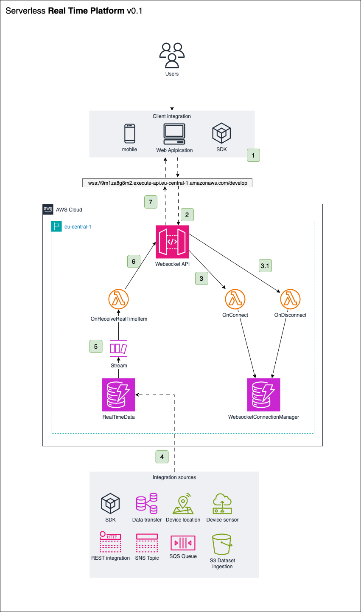
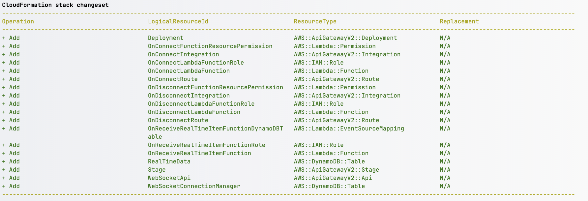

# Real Time Platform

<!-- TOC -->
* [Real Time Platform](#real-time-platform)
  * [Overview](#overview)
    * [About](#about)
    * [Architecture](#architecture)
    * [Project Structure](#project-structure)
    * [SAM](#sam)
  * [Project Prerequisites](#project-prerequisites)
  * [Setup process](#setup-process)
    * [Node](#node)
    * [AWS](#aws)
  * [Development](#development)
    * [Build](#build)
    * [Validate](#validate)
    * [Test](#test)
    * [Local invoke](#local-invoke)
    * [Deploy](#deploy)
    * [Environment Variables](#environment-variables)
  * [How-to](#how-to)
    * [Setup and Test Websocket API](#setup-and-test-websocket-api)
      * [Prerequisites](#prerequisites)
    * [Fetch, tail, and filter Lambda function logs](#fetch-tail-and-filter-lambda-function-logs)
    * [Define a new environment](#define-a-new-environment)
<!-- TOC -->

## Overview
### About
Real Time Platform is consists in a Serverless Application implemented 
in AWS, through SAM framework and with the required cloud resources. 
The main goal of the project is to provide real time data integration for any client/frontend that
is able to integrate with the platform. 

### Architecture
In order to provide a clear overview of the architecture, the following Big picture diagram contains
the main components of the applicaiton and the most rellevant workflow steps.



#### Components:
- **Client Integration**: Frontend application (Mobile & WebApp) that is able to connect to the WebSocket API and receive the real time data updates.
- **WebSocket API Gateway**: Entry point of the application. It's responsible for handling the WebSocket connections and the messages that are sent to the clients.
- **OnConnect Lambda Function**: Is triggered when a client connects to the WebSocket API Gateway. Stores the connection information in the DynamoDB table.
- **OnDisconnect Lambda Function**: Is triggered when a client disconnects from the WebSocket API Gateway. Removes the connection information from the DynamoDB table.
- **OnReceiveRealTimeItem Lambda Function**: Is triggered when a new item is added to the DynamoDB table. Sends the real time data updates to the clients that are interested in the item.
- **RealTimeData DynamoDB Table**: Used to store the real time data items. Each item has a unique key and a value that represents the data that is sent to the clients.
- **WebSocketConnectionManager DynamoDB Table**: Stores the connection information of the clients that are connected to the WebSocket API Gateway. Each item has a unique connectionId and a realTimeItemKey that represents the item that the client is interested in.
- **Integration sources**: Data sources responsible for sending the real time data updates to the platform. For this project, the following sources has been considered:
  - **SDK**: AWS SDK and CLI for any language compatible.
  - **Data transfer**: Any data transfer mechanism that is able to send the data to the platform. For example, data replication from other database.
  - **Device Location & Sensors**: IoT devices that are able to send the data to the platform. For example, GPS location of a vehicle.
  - **REST API**: Any REST API that is able to send the data to the platform. For example, a weather API that sends the weather data to the platform.
  - **Async (SNS, SQS)**: Any asynchronous mechanism that is able to send the data to the platform. For example, an SNS topic that sends the data to the platform.
  - **S3 Events**: Any event that is triggered by an S3 bucket. For example, an event that is triggered when a new file is uploaded to the bucket.

#### Workflow:
1. The client integration connects to the WebSocket API Gateway.
2. The WebSocket API Gateway triggers the OnConnect Lambda function.
3. The OnConnect Lambda function stores the connection information in the WebSocketConnectionManager DynamoDB table.
4. RealTimeData items are added to the RealTimeData DynamoDB table from the integration sources.
5. The OnReceiveRealTimeItem lambda function is triggered through DynamoDB Streams.
6. The OnReceiveRealTimeItem lambda function sends the real time data updates to the clients that are interested in the item.
7. The client integration receives the real time data updates from the WebSocket API Gateway.

### Project Structure
This section contains an overview of how the project structured.
```
    ├── README.md               <-- This instructions file
    ├── template.yaml           <-- AWS SAM template containing API resources
    ├── env.json                <-- Environment variables for Lambda functions
    ├── package.json            <-- NodeJS dependencies and scripts
    ├── samconfig.toml          <-- SAM CLI configuration file
    ├── scripts                 <-- Utility scripts for the CLI usage, like deployment scripts
    ├── src                     <-- Root folder for the source code of the project
    │   └── __tests__           <-- Unit tests
    │   └── handlers            <-- Lambda funtions handlers implementation
    │   └── util                <-- Utility classes and helpers for the project
    ├── jest.config.js          <-- Tests configuration
```


### SAM
The application uses several AWS resources, including Lambda functions, a Websockets API Gateway API, and Amazon DynamoDB tables.
These resources are defined in the `template.yaml` file in this project. You can update the template to add AWS resources
through the same deployment process that updates your application code.

If you prefer to use an integrated development environment (IDE) to build and test your application, you can use the
AWS Toolkit.
The AWS Toolkit is an open-source plugin for popular IDEs that uses the AWS SAM CLI to build and deploy serverless
applications on AWS. The AWS Toolkit also adds step-through debugging for Lambda function code.

In this case, only two IDEs has been considered, see the following:

* [IntelliJ](https://docs.aws.amazon.com/toolkit-for-jetbrains/latest/userguide/welcome.html)
* [VS Code](https://docs.aws.amazon.com/toolkit-for-vscode/latest/userguide/welcome.html)


## Project Prerequisites

The AWS SAM CLI is an extension of the AWS CLI that adds functionality for building and testing Lambda applications.
It uses Docker to run your functions in an Amazon Linux environment that matches Lambda. It can also emulate your
application's build environment and API. To use the AWS SAM CLI, you need the following tools:

* AWS SAM CLI - [Install the AWS SAM CLI](https://docs.aws.amazon.com/serverless-application-model/latest/developerguide/serverless-sam-cli-install.html).
* Node.js - [Install Node.js 20](https://nodejs.org/en/), including the npm package management tool.
* Docker - [Install Docker community edition](https://hub.docker.com/search/?type=edition&offering=community).


## Setup process

### Node
Since we're using NodeJS environment for development, simply run next command to install dependencies:
```bash
npm install
```

### AWS
It's required to install the AWS SAM CLI and the required credentials of the
development environment or feature workspace designated to integrate the code implemented:

[Configure AWS Credentials](https://docs.aws.amazon.com/serverless-application-model/latest/developerguide/serverless-getting-started-set-up-credentials.html)


## Development
### Build
Builds the project, and generates the lambda deployment package
```bash
    npm run build         
```

### Validate
Validates the SAM template
```bash
    npm run validate      
```

### Test
Runs the unit tests for the project
```bash
    npm run test         
```

### Local invoke
Each lambda can be invoked locally using the SAM CLI
```bash
    sam local invoke <function-name> -e event.json
```

### Deploy
The deployment of the SAM Application can be don in several environments, development, staging, and production. 
The configuration of the deployment is done in the `samconfig.toml` file. 

In the process of deployment, the SAM CLI will create a CloudFormation stack with the resources defined in the `template.yaml` file.

Example of the CloudFormation stack created by the SAM CLI:


To deploy the application, run the following command for each environment:

- Development
```bash
    npm run deploy:develop
```

- Pre-production
```bash
    npm run deploy:staging
```

- Production

```bash
    npm run deploy:prod
```
>Caution: This command will deploy the application in the production environment. Only is allowed to run this command if the application is ready to be deployed
>in production and the application has been tested in the staging environment.

### Environment Variables
The environment variables are defined in the `env.json` file, that contains the environment variables that are used in the Lambda functions.

```
{
    "OnConnectLambdaFunction": {
      "TABLE_NAME": "WebSocketConnectionManager",
      "REAL_TIME_ITEM_KEY": "vehicle-id",
      "IS_QUERY_PARAM": "true"
    },
    "OnDisconnectLambdaFunction": {
      "TABLE_NAME": "WebSocketConnectionManager"
    },
    "OnReceiveRealTimeItem": {
      "TABLE_NAME": "WebSocketConnectionManager",
      "WS_ENDPOINT": " https://XXXXXXX.execute-api.eu-central-1.amazonaws.com/develop",
      "REAL_TIME_ITEM_KEY": "vehicle-id"
    }
  }
```

Those variables should be configured in the `template.yaml` file, in the `Environment` section of each Lambda function:

```
    Environment:
      Variables:
        TABLE_NAME: !Ref WebSocketConnectionManager
        REAL_TIME_ITEM_KEY: !Ref RealTimeItemKey
        IS_QUERY_PARAM: !Ref IsQueryParam
```


## How-to
### Setup and Test Websocket API
#### Prerequisites
- [wscat](https://www.npmjs.com/package/wscat) - A simple command line tool for sending and receiving WebSocket messages.

Use the following command to connect to the WebSocket API endpoint. 
```
wscat -c wss://[api-id].execute-api.[aws-region-id].amazonaws.com/[environment]?realTimeItemKey=[item-key]
```

For example, to connect to the WebSocket API endpoint in the development environment, use the following command:
```
wscat -c  wss://svcz00plil.execute-api.eu-central-1.amazonaws.com/develop?realTimeItemKey=1
```
Notice that the `realTimeItemKey` query parameter is required to connect to the WebSocket API. 
This parameter is used to filter the messages that are sent to the client. The value of this parameter must be the same as the `realTimeItemKey` attribute of the item that you want to receive updates for.
According to the project specification, the 'realTimeItemKey' is a dynamic value and can be adapted depending on the client/integration needs. 
For example, if a client wants to receive updates for vehicleId as real time item, the 'realTimeItemKey' should be 'vehicleId', and the command to connect should be:

```
wscat -c  wss://svcz00plil.execute-api.eu-central-1.amazonaws.com/develop?vehicleId=3
```


### Fetch, tail, and filter Lambda function logs

To simplify troubleshooting, the AWS SAM CLI has a command called `sam logs`. `sam logs` lets you fetch logs that are
generated by your Lambda function from the command line. In addition to printing the logs on the terminal,
this command has several nifty features to help you quickly find the bug.

**NOTE:** This command works for all Lambda functions, not just the ones you deploy using AWS SAM.

```bash
sam logs -n putItemFunction --stack-name sam-app --tail
```

**NOTE:** This uses the logical name of the function within the stack. This is the correct name to use when searching
logs inside an AWS Lambda function within a CloudFormation stack, even if the deployed function name varies due to
CloudFormation's unique resource name generation.

You can find more information and examples about filtering Lambda function logs in the [AWS SAM CLI documentation](https://docs.aws.amazon.com/serverless-application-model/latest/developerguide/serverless-sam-cli-logging.html).

### Define a new environment
If a new environment is required, the configuration of the environment must be added to the `samconfig.toml` file. To do this is necessary to run the following command:
```bash
    sam deploy --guided
```
Follow the instructions and provide the required information for the new environment.


